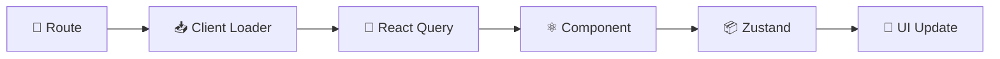

<div align="center">

# ⚡️ React Vite Boilerplate

### 🚀 React Router 7 + React Query + Zustand

[](https://react.dev)
[](https://reactrouter.com)
[](https://tanstack.com/query)
[](https://zustand-demo.pmnd.rs)
[](https://typescriptlang.org)

</div>

---

## 🎯 What You Get

| 🧭 **React Router 7** | 🔄 **React Query** | 📦 **Zustand**     |
| --------------------- | ------------------ | ------------------ |
| Programmatic routes   | Smart caching      | Lightweight stores |
| Client loaders        | Auto-refetching    | Zero boilerplate   |
| Nested layouts        | Background sync    | TypeScript ready   |

**Plus:** React 19 • Vite 6 • Tailwind v4 • TypeScript • Tests • Themes

## 🏗️ How It Works



**Data Flow:**

1. **Route** loads → 2. **Client Loader** prefetches → 3. **React Query** caches → 4. **Component** renders → 5. **Zustand** manages UI state

## 📂 Structure

```
app/
├── routes.ts                    # 🧭 Route definitions
├── routes/
│   ├── layout.tsx              # 🏠 Root layout
│   ├── home/
│   │   ├── home.tsx            # / route
│   │   └── components/
│   ├── not-found/
│   │   ├── not-found.tsx       # catch-all route
│   │   └── components/
│   ├── [module]/
│   │   ├── layout.tsx          # 🎨 Module layout
│   │   ├── list.tsx            # /module route
│   │   ├── detail.tsx          # /module/:id route
│   │   ├── components/         # ⚛️ UI components (flat, no subfolders)
│   │   ├── containers/         # 🔗 Compose components + hooks
│   │   ├── hooks/              # 🔄 React Query + business logic
│   │   ├── stores/             # 📦 Zustand UI state (no server data)
│   │   ├── repositories/       # 📡 Pure HTTP clients (no React)
│   │   └── types/              # 🔷 TypeScript definitions
│   └── shared/                 # 🤝 Cross-module resources
└── styles/                     # 🎨 CSS & themes

tests/routes/                   # 🧪 MUST mirror app/routes exactly
```

**Architecture Rules:**

- 📁 **Module isolation** - each feature self-contained, promote to `shared/` when used across modules
- 🚫 **Separation of concerns** - Components (UI) ≠ Containers (composition) ≠ Hooks (logic) ≠ Repositories (HTTP)
- 🔄 **Data flow** - Repository → Hook → Container → Component
- 📋 **Flat components** - single `/components` folder per module, no subfolders
- 🧪 **Test mirroring** - `tests/routes/[module]/[file].test.tsx` exactly matches `app/routes/[module]/[file].tsx`

## 🧭 Programmatic Routing Example

**Define routes in code, not file structure** ✨

```ts
// app/routes.ts
export default [
  route("/login", "routes/auth/login.tsx"),
  layout("routes/layout.tsx", [
    index("routes/home/home.tsx"), // → /
    route("/pokemon", "routes/pokemon/layout.tsx", [
      index("routes/pokemon/list.tsx"), // → /pokemon
      route(":name", "routes/pokemon/detail.tsx"), // → /pokemon/pikachu
    ]),
    route("*", "routes/not-found/not-found.tsx"),
  ]),
] satisfies RouteConfig
```

**Navigate programmatically:**

```tsx
import { useNavigate } from "react-router"

function PokemonCard({ pokemon }) {
  const navigate = useNavigate()

  return (
    <div onClick={() => navigate(`/pokemon/${pokemon.name}`)}>
      {pokemon.name}
    </div>
  )
}
```

## 🔄 Smart Data Prefetching

**Client loaders + React Query = Instant UX** ⚡️

```tsx
// Route prefetches before rendering
export const clientLoader =
  (queryClient: QueryClient) =>
  async ({ params }: Route.ClientLoaderArgs) => {
    const name = params.name ?? ""
    if (!name) throw new Response("Missing pokemon name", { status: 400 })

    await queryClient.prefetchQuery({
      queryKey: ["pokemon", name],
      queryFn: () => pokemonRepository.fetchPokemonByName(name),
    })
    return null
  }

// Component gets cached data instantly
export default function PokemonDetailRoute() {
  const { name } = useParams()
  const { data } = useQuery({
    queryKey: ["pokemon", name],
    queryFn: () => pokemonRepository.fetchPokemonByName(name),
  })
  return <PokemonDetails data={data} />
}
```

## 🔄 React Query Pattern

**Repository → Hook → Component** 🎯

```ts
// 📡 Repository (pure HTTP)
const pokemonRepository = {
  fetchList: ({ limit, offset }) =>
    pokemonHttp.get("/pokemon", { params: { limit, offset } }),
  fetchByName: (name) => pokemonHttp.get(`/pokemon/${name}`),
}
```

```tsx
// 🪝 Custom Hook (React Query)
export function usePokemonInfiniteQuery() {
  return useInfiniteQuery({
    queryKey: ["pokemon", "list"],
    queryFn: ({ pageParam = 0 }) =>
      pokemonRepository.fetchList({ limit: 20, offset: pageParam }),
    getNextPageParam: (lastPage) => lastPage.nextOffset,
  })
}
```

```tsx
// ⚛️ Component (consume hook)
function PokemonList() {
  const { data, fetchNextPage, hasNextPage } = usePokemonInfiniteQuery()
  return (
    <InfiniteScroll onLoadMore={fetchNextPage} hasMore={hasNextPage}>
      {data?.pages.map((page) =>
        page.items.map((pokemon) => (
          <PokemonCard key={pokemon.name} {...pokemon} />
        )),
      )}
    </InfiniteScroll>
  )
}
```

## 📦 Zustand UI State

**Simple stores for UI stuff** 🎨

```ts
export const usePokemonUiStore = create((set) => ({
  searchQuery: "",
  viewMode: "grid",
  selectedTypes: [],

  setSearchQuery: (query) => set({ searchQuery: query }),
  toggleViewMode: () =>
    set((state) => ({ viewMode: state.viewMode === "grid" ? "list" : "grid" })),
  setSelectedTypes: (types) => set({ selectedTypes: types }),
}))
```

## 🚀 Get Started

```bash
npm install && npm run dev
# → http://localhost:5173 ✨
```

## 🛠️ Scripts

| Command         | What it does          |
| --------------- | --------------------- |
| `npm run dev`   | 🔥 Start dev server   |
| `npm run build` | 📦 Production build   |
| `npm run test`  | 🧪 Run tests          |
| `npm run lint`  | 🔍 Check code quality |

## 🧪 Testing

**Structure mirrors routes** → `tests/routes/` ↔ `app/routes/`

```bash
npm run test:watch     # 👀 Watch mode
npm run test:coverage  # 📊 Coverage report
```

---

<div align="center">

### 🎯 **React Router 7** + **React Query** + **Zustand**

_The perfect React SPA trinity_ ⚡️

**[🧭 Programmatic Routing](#-programmatic-routing-example)** • **[🔄 Smart Caching](#-smart-data-prefetching)** • **[📦 Simple State](#-zustand-ui-state)**

</div>
